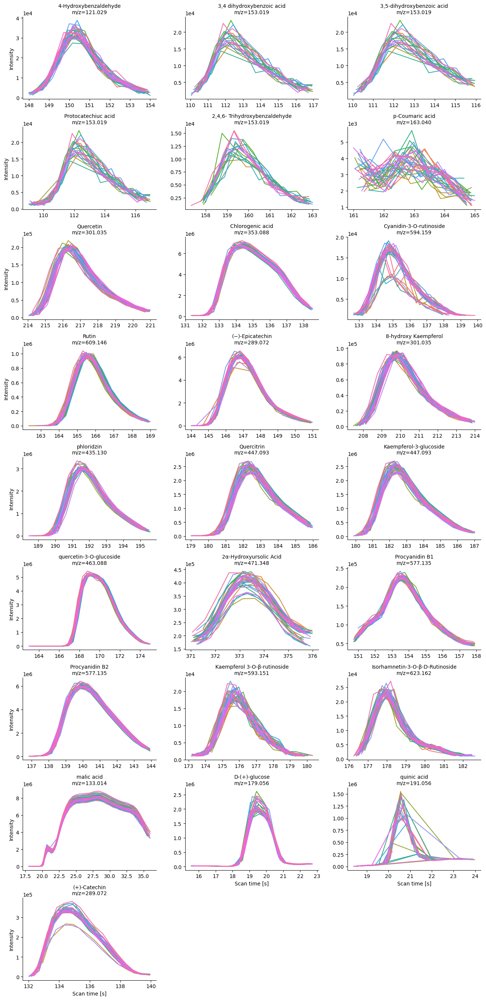

Apple phytochemical targeted integration
================

Authors: $Daniel Quiroz^1$, $Jessica Coopestone^{1, 2}$

Affilliations:

- $1$ Horticulture and Crop Science Department, Ohio State University,
  USA
- $2$ Food and Science Department, Ohio State University, USA

## About this repository

This repository host the targeted integration of metabolomics data
reported in [Bilbrey et
al. (2022)](https://nph.onlinelibrary.wiley.com/doi/full/10.1111/nph.17693).

The targeted integration is conducted using
[ms-mint](https://github.com/LewisResearchGroup/ms-mint). Compound
identification was conducted by comparison of samples against authentic
standards, as well as using public availables MS/MS in GNPS.

More details about the in-house MS/MS library can be found at
[PhenolicsDB](https://github.com/CooperstoneLab/PhenolicsDB), while a
representative GNPS molecular network can be found in this
[repository](https://cytoscape.gnps2.org/process?task=1b4d04e4234d47f38ad8681da8307b91).

## Pythochemical target list

Briefly, we collected full scan data $MS^1$ in both polarities (positive
and negative), to achieve a greater metabolome coverage. In the
following table you will find the list of identified metabolites in each
polarity.

You can find the detailed analysis notebook
[here](https://github.com/CooperstoneLab/apple_phytochemicals/blob/main/1_QC_targeted_integration.ipynb).

### Negative polarity

#### Target list

    ##                         peak_label     mz_mean mz_width  rt intensity_threshold
    ## 1            4-Hydroxybenzaldehyde 121.0294794       10 150                1000
    ## 2        3,4 dihydroxybenzoic acid 153.0193087       10 112                1000
    ## 3        3,5-dihydroxybenzoic acid 153.0193087       10 112                1000
    ## 4              Protocatechiuc acid 153.0193087       10 112                1000
    ## 5    2,4,6- Trihydroxybenzaldehyde 153.0193087       10 159                1000
    ## 6                  p-Coumaric acid   163.04004       10 163                1000
    ## 7                        Quercetin    301.0353       10 217                1000
    ## 8                 Chlorogenic acid   353.08778       10 135                1000
    ## 9          Cyanidin-3-O-rutinoside    594.1589       10 136                1000
    ## 10                           Rutin   609.14608       10 166                1000
    ## 11                 (−)-Epicatechin   289.07173       10 147                1000
    ## 12            8-hydroxy Kaempferol   301.03535       10 210                1000
    ## 13                      phloridzin   435.12964       10 192                1000
    ## 14                      Quercitrin   447.09326       10 183                1000
    ## 15          Kaempferol-3-glucoside   447.09326       10 183                1000
    ## 16         quercetin-3-O-glucoside   463.08817       10 169                1000
    ## 17          2α-Hydroxyursolic Acid    471.3479       10 373                1000
    ## 18                  Procyanidin B1    577.1351       10 154                1000
    ## 19                  Procyanidin B2    577.1351       10 140                1000
    ## 20     Kaempferol 3-O-β-rutinoside    593.1511       10 177                1000
    ## 21 Isorhamnetin-3-O-β-D-Rutinoside    623.1617       10 179                1000
    ## 22                      malic acid   133.01422       10  30                1000
    ## 23                   D-(+)-glucose     179.056       10  19                1000
    ## 24                     quinic acid   191.05608       10  20                1000
    ## 25                    (+)-Catechin   289.07173       10 135                1000

#### Peak shapes

### Positive polarity

#### Target list

    ##                         peak_label     mz_mean mz_width  rt intensity_threshold
    ## 1            trans-3-coumaric acid   165.05464       10 177                1000
    ## 2                     Ellagic acid 303.0135672       10 171                1000
    ## 3                        Quercetin    303.0499       10 216                1000
    ## 4                 Chlorogenic acid   355.10238       10 134                1000
    ## 5          Cyanidin-3-O-rutinoside    596.1735       10 135                1000
    ## 6                    Rutin hydrate   611.16068       10 167                1000
    ## 7                  (−)-Epicatechin   291.08633       10 148                1000
    ## 8                       phloridzin   437.14424       10 191                1000
    ## 9                       quercitrin   449.10786       10 182                1000
    ## 10          Kaempferol-3-glucoside   449.10786       10 182                1000
    ## 11       quercetin-3-O-galactoside   465.10277       10 169                1000
    ## 12          2α-Hydroxyursolic Acid    473.3625       10 408                1000
    ## 13                  Procyanidin B1    579.1497       10 126                1000
    ## 14                  Procyanidin B2    579.1497       10 140                1000
    ## 15 Isorhamnetin-3-O-β-D-Rutinoside    625.1763       10 178                1000
    ## 16                  procyanidyn c1    867.2131       15 149                1000
    ## 17                      D-sorbitol    183.0863       10  20                1000
    ## 18                    (+)-Catechin   291.08633       10 135                1000

#### Peak shapes

